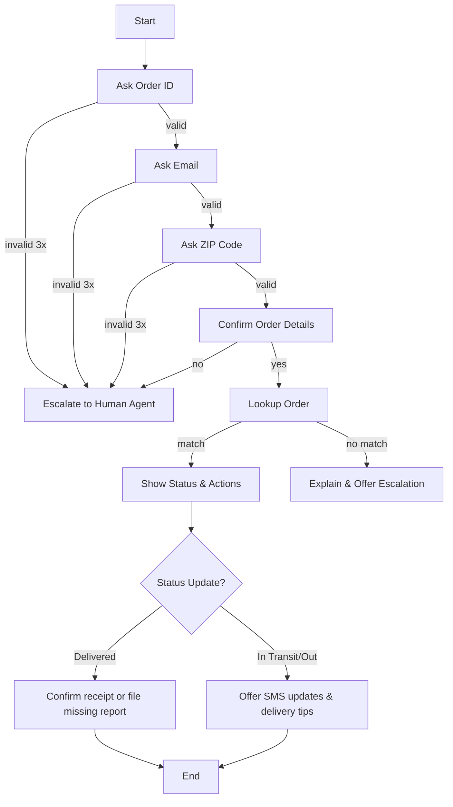

# AI-Analyst-Chatbot: Lost Package
Take-home assignment for eGain's AI Analyst role: Lost Package Chatbot prototype

# Lost Package Chatbot – CLI Prototype

**Role/Assignment:** eGain AI Analyst Take-Home  
**Scenario:** Helping a customer track a lost package  
**Author:** Dina Trac

## Overview
This is a simple command-line chatbot that helps customers check the status of a package and take next steps (such as enable updates, set delivery preferences, and file a missing-package report). The focus is on:
- Clear conversation flow and validation 
- Error handling and safe fallbacks
- Human escalation when confidence is low
- Clean, extendable code
- A mock backend (sample orders) ?

## Quick Start
```bash
python3 lost_package_bot.py
```
> The chatbot will ask for **Order ID** (Ex:, `AB-123456`), **email**, and **ZIP code**.

## Sample Orders (for testing purposes)
- AB-123456 / dora@gmail.com / 94107 → In Transit (USPS)
- AB-654321 / dino@yahoo.com / 93402 → Out for Delivery (UPS)
- AB-112233 / devin@gmail.com / 94704 → Delivered (FedEx)

## Error Handling Examples
1. **Invalid Order ID format**  
   - If user enters `123456` or `AB-12A456`, the chatbot reprompts up to 3 times with an example (`AB-123456`), then escalates.
2. **Ambiguous yes/no answers**  
   - For confirmation prompts, the bot reprompts up to 3 times if input isn’t `Yes/No`. Then it falls back safely.
3. **Mismatched identity**  
   - If email/ZIP don’t match the order, the bot explains and offers human escalation.
  
## Flowchart (Mermaid)


## Notes on Design Choices
- **Stateful prompts** to reduce cognitive load and catch errors early.
- **Human-Agent-in-the-loop** for sensitive cases (ID mismatch, repeated invalid inputs).
- **Friendly and Positive tone** and next best actions to drive resolution.

## Possible Improvements
- Real carrier API integration
- Session memory & authentication
- Multi-lingual language support
- Web UI with chatbot widgets

